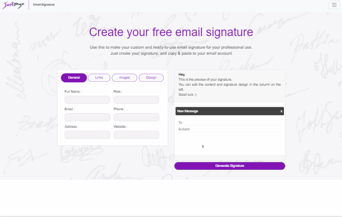

# Email Signature Generator

> Just-Sign is an online email signature generator that helps create professional and visually compelling email signatures
> for Gmail,Outlook, Apple Mail, Thunderbird and Office 365 client .
>*[www.just-sign.com](https://www.just-sign.com)*

---

<!--  -->
---

## Table of contents
* [General info](#general-info)
* [User Stories](#User-Stories)
* [Technologies](#technologies)
* [Contact](#contact)

## General info:
### 1. Easy-to-use email signature generator.
### 2. Online free Tool.
### 3. Increase your brand awareness.
## 

## User Stories
-   [ ] User can create email Signature in 60 seconds.
-   [ ] User can create signatures from any device.
-   [ ] User can add social media links.
-   [ ] User can design and style .
-   [ ] User can copy & paste to his email accoun.

## Technologies
* React-strap 8.4.1
* Bootstrap 4
* React-Router 5.1.2
* Firebase Hosting.
* Firebase Storage.
* DNS, custom domain name from Goddady. 
* HTMl, CSS, JavaScript.
* UI/UX Figma.

## Contact
Created by [@Ron-Fybish](https://www.linkedin.com/in/ron-fybish-9b0194157/) - feel free to contact meat <fybishron@gmail.com> !
##[www.just-sign.com](https://www.just-sign.com)
